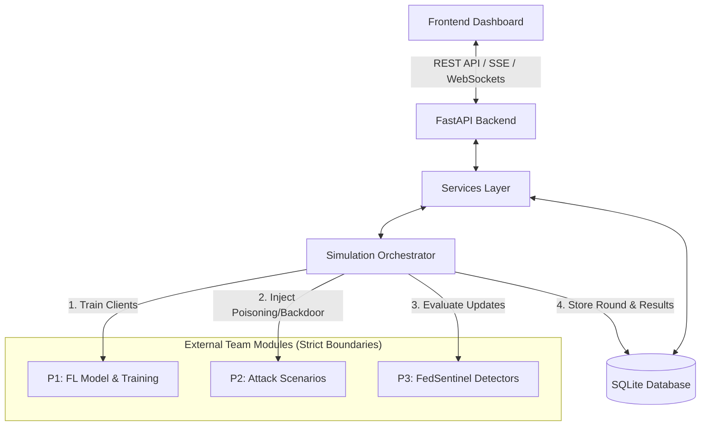

# FedSentinel — Person 4 Implementation Plan
**Backend, Database, API, Simulation Orchestration, Dashboard, Integration & Demo**

## Overview & Architecture Boundaries

As **Person 4**, our core mission is to build the central nervous system of **FedSentinel**:
1. **FastAPI Backend & REST APIs** for frontend communication and experiment management.
2. **Database Persistence (SQLite + SQLAlchemy)** to record simulation runs, rounds, client updates, threat detection results, impact evaluations, and recovery actions.
3. **Simulation Orchestrator (`runner.py`, `scenario_manager.py`)** to drive the end-to-end FL training loop across rounds:
   $$\text{Global Model} \to \text{P1 (Train)} \to \text{P2 (Attack)} \to \text{P3 (Sentinel)} \to \text{Decisions \& Aggregation} \to \text{Recovery Check} \to \text{DB} \to \text{Dashboard}$$
4. **Interactive Dashboard**: Real-time visualization of model performance, explainable client threat scores, quarantine actions, recovery timelines, and live attack controls.
5. **Contract Adherence & Integration Stubs**: Respect frozen contracts (`ModelUpdate`, `DetectionResult`, `ImpactResult`, `RecoveryResult`). Maintain modular interfaces so P1, P2, and P3 modules can plug in seamlessly without touching API or database code.



> [!IMPORTANT]
> **Strict Contract Boundaries — What Person 4 Does NOT Build:**
> - **No FL Model Internals or Aggregation Math:** Owned by P1.
> - **No Attack Math or Injection Algorithms:** Owned by P2.
> - **No Threat Score Math, Cosine Similarities, or Anomaly Detectors:** Owned by P3.
> - **No logic calculation in API routes:** API routes merely validate, transport, and retrieve canonical schemas.

---

## Phased Implementation Roadmap

### Phase 1: Directory Layout & Backend Skeleton
Set up the standard project structure inside a dedicated workspace folder (`fedsentinel/`):
```text
fedsentinel/
├── backend/
│   ├── main.py                    # FastAPI entrypoint & CORS middleware
│   ├── config.py                  # Simulation and server configurations
│   ├── api/
│   │   ├── deps.py                # Database and service dependencies
│   │   ├── routes/
│   │   │   ├── simulation.py      # POST /simulation/start, /stop, /status
│   │   │   ├── clients.py         # GET /clients, GET /clients/{id}
│   │   │   ├── rounds.py          # GET /rounds, GET /rounds/{id}
│   │   │   ├── threats.py         # GET /threats, GET /threats/{client_id}
│   │   │   ├── metrics.py         # GET /metrics/global, GET /metrics/runs/{id}
│   │   │   └── recovery.py        # GET /recovery/history, GET /recovery/status
│   │   └── schemas/
│   │       ├── simulation.py      # SimulationConfig, SimulationStatus
│   │       ├── contracts.py       # Frozen ModelUpdate, DetectionResult, ImpactResult, RecoveryResult
│   │       └── metrics.py         # GlobalMetrics, RoundMetrics
│   ├── services/
│   │   ├── simulation_service.py  # High-level orchestration manager
│   │   ├── client_service.py      # Client history & query operations
│   │   ├── threat_service.py      # Threat lookups & signal formatting
│   │   ├── metrics_service.py     # Aggregated metric queries
│   │   └── recovery_service.py    # Recovery incident tracking
│   ├── database/
│   │   ├── database.py            # SQLite engine, sessionmaker, Base
│   │   ├── models.py              # SQLAlchemy ORM models
│   │   └── repositories.py        # Clean CRUD repository layer
│   └── simulation/
│       ├── runner.py              # Core simulation loop runner
│       ├── scenario_manager.py    # Attack & round scenario coordinator
│       └── interfaces.py          # Abstract interfaces & pluggable adapters for P1, P2, P3
├── frontend/                      # FedSentinel Security Monitor Dashboard
│   ├── index.html                 # Modern dashboard layout
│   ├── css/                       # Premium dark theme styling
│   └── js/                        # Reactive components (State, Charts, Audit Timeline, Controls)
├── tests/
│   ├── test_api.py                # REST API contract verification
│   ├── test_database.py           # DB models and relational integrity tests
│   └── test_orchestrator.py       # Full simulation pipeline integration tests
└── requirements.txt
```

### Phase 2: Database Layer & Data Models
Implement SQLAlchemy models mapped to SQLite for zero-setup portability:
- **`SimulationRun`**: `run_id`, `name`, `status` (PENDING, RUNNING, COMPLETED, FAILED), `total_rounds`, `client_count`, `attack_scenario`, `seed`, timestamps.
- **`Round`**: `round_id`, `run_id`, `round_number`, `global_accuracy`, `global_loss`, `model_version`, `recovery_triggered`.
- **`Client`**: `client_id`, `reputation_score`, `total_participations`, `quarantine_status`, `last_threat_score`.
- **`ThreatLog`**: `id`, `run_id`, `round_number`, `client_id`, `threat_score`, `classification` (SAFE, SUSPICIOUS, MALICIOUS), `action` (ACCEPT, QUARANTINE, REJECT), `signals` (JSON), `reasons` (JSON).
- **`RecoveryEvent`**: `id`, `run_id`, `round_number`, `triggered`, `reason`, `checkpoint_version`, `recovered_accuracy`, `quarantined_updates` (JSON).
- **`AuditLog`**: `id`, `run_id`, `round_number`, `timestamp`, `event_type`, `severity` (INFO, WARN, ALERT), `message`.

### Phase 3: Frozen API Contracts
Define strict Pydantic models matching team contracts:
- **`ModelUpdate`**: `update_id`, `run_id`, `round_id`, `client_id`, `model_version`, `base_model_version`, `parameters` (weights/gradients or metadata), `sample_count`, `local_loss`, `local_accuracy`, `training_epochs`, `learning_rate`, `metadata`.
- **`DetectionResult`**: `client_id`, `round_id`, `threat_score` (0-100), `classification` (SAFE, SUSPICIOUS, MALICIOUS), `action` (ACCEPT, QUARANTINE, REJECT), `signals` (dict), `reasons` (list of strings).
- **`ImpactResult`**: `estimated_degradation`, `risk_level` (LOW, MEDIUM, HIGH, CRITICAL), `recommendation`.
- **`RecoveryResult`**: `recovery_needed`, `checkpoint_id`, `reaggregation_clients`, `reason`.

### Phase 4: Simulation Orchestrator
Build `simulation/runner.py` to control the round loop asynchronously (background task/thread):
1. **Initialize**: Create `SimulationRun` in DB, initialize global model state via P1 interface.
2. **For each round ($1 \dots N$):**
   - **Distribute**: Pass global model parameters to P1 clients.
   - **Local Train**: P1 produces `List[ModelUpdate]`.
   - **Attack Injection**: P2 modifies designated attacker updates based on active scenario (Backdoor, Label Poisoning, Byzantine, Model Scaling).
   - **Sentinel Inspection**: P3 inspects updates, producing `List[DetectionResult]`.
   - **Impact Estimation & Action Filtering**: Filter out `QUARANTINE` or `REJECT` updates.
   - **Aggregation**: P1 aggregates clean updates into new global model candidate.
   - **Evaluation & Recovery Check**: If accuracy drops below threshold or backdoor detected, trigger P3/P1 recovery (restore trusted checkpoint, prune attacker, re-aggregate).
   - **Persist & Notify**: Save round metrics, threat logs, and audit events to database; broadcast updates to the dashboard.
3. **Pluggable Architecture**:
   - Provide high-fidelity **Stub Adapters** (`MockP1FL`, `MockP2Attacks`, `MockP3Sentinel`) implementing realistic behaviors for immediate end-to-end testing and demo reliability.
   - When P1, P2, and P3 deliver their modules, replace stubs via clean adapter configuration without touching orchestrator or DB code!

### Phase 5: Dashboard Implementation
Build a standalone, high-performance web dashboard (embedded static UI served by FastAPI or modern SPA):
1. **Top Bar**: System status (RUNNING / IDLE), current round progress (e.g. Round 12 / 20), active clients count, global accuracy badge.
2. **Global Model Performance**: Interactive dynamic charts (Accuracy & Loss curve across rounds).
3. **Client Threat Matrix (`ClientTable`)**: Real-time table with client IDs, reputation score, threat score meter (0-100), status tags (SAFE / SUSPICIOUS / MALICIOUS).
4. **Explainable Threat Inspector (`ThreatPanel` & `ImpactPanel`)**: Detailed inspect view showing:
   - Threat score breakdown bar (e.g., `91/100 MALICIOUS`).
   - Signal indicators (magnitude anomaly, cosine similarity to peers, loss divergence).
   - Plain-English reasons (`Abnormal gradient norm`, `Low peer similarity`, etc.).
   - Action taken (`QUARANTINE`).
5. **Recovery Timeline (`RecoveryPanel`)**: Visual event card showing degradation detection, checkpoint rollback, and recovered accuracy.
6. **Simulation Control Panel (`AttackControl`)**:
   - Attack type selector: `Normal (No attack)`, `Model Poisoning`, `Backdoor Trigger`, `Byzantine / Noise`, `Label Flip`.
   - Number of clients & attacker count.
   - Attack start round & intensity slider.
   - One-click `[ Start Simulation ]`, `[ Pause ]`, `[ Reset ]`.
7. **Audit & Event Log**: Live chronological timeline of round events with color-coded severity.
8. **Before vs. After Comparison**: Side-by-side metric comparison (Unprotected FL with attack vs FedSentinel with Sentinel defense).

### Phase 6: Integration Testing & Demo Verification
1. **Automated API Tests**: Test all endpoints (`/health`, `/simulation/start`, `/clients`, `/threats`, `/metrics`, `/recovery`).
2. **Database Integration Tests**: Verify round records, cascade relations, and threat logs are persisted correctly.
3. **End-to-End Orchestrator Run**: Run a full 10-round simulated workflow with a backdoor attack at round 5, verifying Sentinel detection and automated recovery.
4. **Live Demo Polish**: Pre-packaged demo scenario presets for fast judge presentation.

---

## Verification Plan

### Automated Tests
- `pytest tests/test_api.py`: Verify FastAPI endpoints, schemas, response formats, and status codes.
- `pytest tests/test_database.py`: Verify SQLite transactions, models, and repository queries.
- `pytest tests/test_orchestrator.py`: Verify complete 10-round pipeline execution, database persistence, and recovery event generation.

### Manual / Demo Verification
1. Start backend: `python -m uvicorn backend.main:app --reload --port 8000`.
2. Open dashboard in browser (`http://localhost:8000`).
3. Launch a 10-round simulation with Backdoor attack starting at Round 5.
4. Watch live accuracy curve, see Client 07 flagged with Threat Score 91, observe QUARANTINE action, inspect recovery incident at degradation, and check audit logs.
